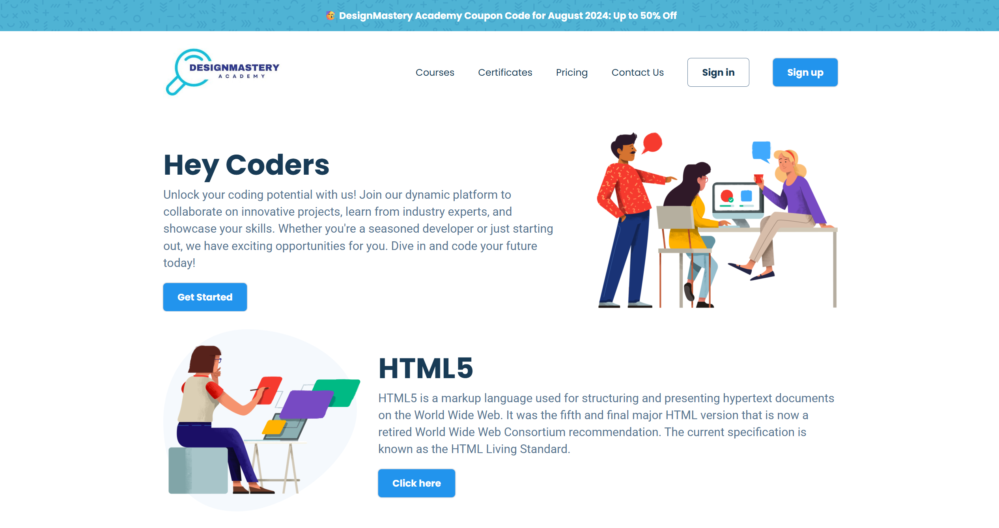

<p align="center">
  
</p>

<h1 align="center">🌐 Course Listing Website </h1>

<p align="center">
  A beautiful and responsive web interface built using just HTML and CSS.<br>
  <strong>Simple. Clean. Elegant.</strong>
</p>

---

## 📌 Features

- 🎨 Clean UI Design using CSS
- 💻 Responsive layout for mobile and desktop
- ⚡ Fast-loading static content
- 📁 Structured and easy to customize

---

## 📸 Preview



---

## 🛠️ Tech Stack

- **HTML5** – Structure of the webpage
- **CSS3** – Styling and layout

---

## 🚀 Getting Started

To get a local copy up and running, follow these simple steps:

```bash
# Clone the repository
git clone https://github.com/rohannayak360/Course-Listing-Website.git

# Navigate into the project folder
cd Course-Listing-Website

# Open index.html in your browser
